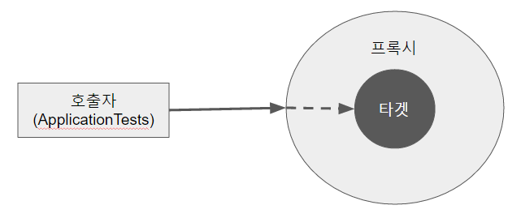

# AOP란?

> AOP(Aspect Oriented Programming) : 특정 로직을 기준으로 핵심적인 관점, 부가적인 관점으로 나누어서 모듈화 하는 프로그래밍 방식 

- AOP는 애플리케이션 전체에 걸쳐 사용되는 **기능을 재사용**하도록 지원하는 것이다.

**핵심적인 관점**
- 우리가 적용하고자 하는 핵심 비즈니스 로직

**부가적인 관점**
- 핵심 로직을 실행하기 위해 행해지는 DB Connect, Logging, File I/O

AOP 에서는 이러한 관점들을 모듈화하는 것을 의미한다.  
하지만, 모듈화 하기 이전에는 소스 코드가 반복해서 쓰여지는 코드들이 있을 것인데, 이를 **흩어진 관심사(Crosscutting Concerns)** 라 부른다.


이러한 **흩어진 관심사를 하나의 관점**으로 보고 **모듈화**하여  
핵심적인 비즈니스 로직에서 **분리**하여 **재사용하여 반복적으로 사용되는 코드를 줄이는 것이 AOP의 취지**

## 주요 개념

- **Aspect**: **흩어진 관심사를 모듈화**한 것. 주로 부가기능을 모듈화함
- **Target**: Aspect를 **적용하는 대상**. 주로 핵심기능을 가진 객체
- **Advice**: Aspect의 구현체. 실제로 **부가기능을 담은 코드**
- **Join point**: Advice가 적용될 수 있는 **위치.** 메소드 실행 시점 등
- **Pointcut**: Join point의 부분집합으로, **실제로 Advice가 적용되는 Join point**를 나타냄
- **Weaving**: Advice를 **Target에 적용하는 과정**

# 스프링 AOP 특징

- 순수 자바로 구현되었기 때문에 특별한 컴파일 과정이 필요하지 않다
- 프록시 기반 AOP를 지원한다
- 타겟 객체에 대한 프록시를 런타임에 동적으로 생성하여 부가기능을 적용한다
- 스프링 빈에만 AOP를 적용할 수 있다
- 스프링 IoC와 연동하여 엔터프라이즈 애플리케이션에서의 문제를 해결하는데 초점을 맞춘다
- 메서드 조인 포인트만 지원한다 
- 동적 프록시를 기반으로 하므로 메서드 실행 시점에만 Advice를 적용할 수 있다

AOP는 OOP를 보완하는 프로그래밍 기법. 관심사의 분리와 모듈화를 통해 코드의 중복을 줄이고 유지보수성을 높일 수 있다.

## 프록시 기반 AOP

> **프록시 기반 AOP** : **타겟 객체에 대한 프록시를 런타임에 동적으로 생성하여 부가기능을 적용하는 방식**



- 프록시는 타겟 객체를 감싸고 있으며, 타겟 객체의 메서드를 호출할 때 Advice를 실행함 
- 스프링 AOP는 스프링 빈에만 프록시를 적용할 수 있음  

> 프록시 패턴 : 다른 객체와 이어지는 인터페이스의 역할을 하는 클래스를 사용하여 접근을 제어하는 디자인 패턴


## 프록시 기반 AOP 동작

메서드에 주료 사용하게 되는 `@Transactional`를 에를 들면,


```kotlin
@Service  
class UserService(private val userRepository: UserRepository) {  
  
    // @Transactional 애노테이션이 붙은 메소드  
    @Transactional  
    fun createUser(name: String) {  
        val user: User = userRepository.findByName(name)   
?: throw IllegalArgumentException("does null is $name")  
        userRepository.save(user)  
        // 비즈니스 로직 ...    }  
}  
  
// 클라이언트 클래스  
@Controller  
class UserController(private val userService: UserService) {  
    // userService.createUser(user) 메소드 호출  
    fun registerUser(name: String): String {  
        userService.createUser(name)  
        return "success"  
    }  
}
```

1.  스프링 컨테이너가 UserService 클래스를 스캔하여 @Transactional이 붙은 createUser 메소드를 찾는다
2.  스프링 컨테이너가 UserService 클래스의 프록시 객체를 생성한 후 빈으로 등록한다 프록시 객체는 UserService 인터페이스를 상속받아 만든다
3.  UserController 클래스가 userService.createUser(user) 메소드를 호출하고 프록시 객체가 요청을 가로챈다
4.  프록시 객체는 트랜잭션 매니저에게 트랜잭션을 시작하라고 요청한다
5.  트랜잭션 매니저는 데이터베이스와 연결된 커넥션을 생성하고 트랜잭션을 시작한다
6.  프록시 객체는 원본 UserService 객체의 createUser 메소드를 호출하고 결과를 반환받는다
7.  프록시 객체는 트랜잭션 매니저에게 트랜잭션을 종료하라고 요청한다 만약 예외가 발생하지 않았다면 커밋을 하고, 예외가 발생했다면 롤백을 한다
8.  트랜잭션 매니저는 데이터베이스와 연결된 커넥션을 닫고 트랜잭션을 종료한다

## AOP 장점
- 코드의 중복을 줄일 수 있다.
- 핵심기능과 부가기능의 응집도를 높일 수 있다.
- 유지보수성과 재사용성을 향상시킬 수 있다.

## AOP 단점
- 복잡도가 증가할 수 있다.
- 디버깅이 어려울 수 있다.
