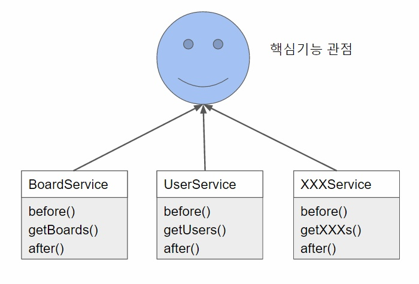

# AOP란?

Spring의 핵심 개념 중 하나인 DI가 애플리케이션 모듈들 간의 결합도를 낮춰준다면, AOP는 애플리케이션 전체에 걸쳐 사용되는 **기능을 재사용**하도록 지원하는 것입니다

AOP (Aspect-Oriented Programming)란 단어를 번역하면 **관점 지향 프로그래밍**이 됩니다

쉽게 얘기해 프로젝트 구조를 바라보는 **관점**을 바꿔보자는 이야기입니다

우리는 보통 제 3자의 관점에서 바라보자 라는 이야기를 합니다.

(제 3자의 관점)

즉, **대상을 바라보는 방향을 바꿔라** 란 이야기입니다.

(핵심 기능에서 바라본 관점)

각각의 Service는 핵심 기능에서 바라보았을 때 Board, User, XXX 등 **공통된 요소가 없습니다.**

이런 관점에서 각각의 Service는 각자 코드를 새로 구현하고 있다. 하지만, 이 관점을 돌려서 **부가기능** 이란 관점에서 바라보면 달리 보입니다.

(부가기능에서 바라본 관점)

부가기능의 관점에서 바라보면 각각의 Service는 수행시간 측정을 나타내는 before라는 메소드와 after라는 메소드가 공통되는 것을 알 수 있습니다.

- **AOP는 여기서부터 시작합니다.**

기존에 OOP에서 바라보던 관점을 다르게 하여 부가기능적인 측면에서 보았을 때 공통된 요소를 추추라자는 것입니다.

이때 가로(횡단) 영역의 공통된 부분을 잘라냈다고 하여, AOP를 **크로스 컷팅(Cross-Cutting)** 이라고 불리기도 합니다.

# AOP 주요 개념

Target : 부가기능을 부여할 대상을 얘기합니다

Aspect : 부가기능 모듈로 **핵심기능에 부가되어 의미를 갖는** 특별한 모듈이라고 할 수 있습니다. 에스펙트는 부가될 기능을 정의한 **Advice**와 이 Advice를 어디에 적용할지를 결정하는 **포인트컷을** 함께 갖고 있습니다.

**Advice :** 

실질적으로 부가기능을 담은 구현체를 얘기합니다. 어드바이스의 경우 타겟 오프젝트에 종속되지 않기 때문에 순수하게 **부가기능에만 집중**할 수 있습니다. 어드바이스는 에스펙트가 '무엇'을 '언제'할지를 정의하고 있습니다

**PointCut :**

부가기능이 적용될 대상(메소드)를 선정하는 방법을 얘기합니다.

즉, 어드바이스를 적용할 조인포인트를 선별하는 기능을 정의한 모듈을 얘기합니다.

**JoinPoint** :

어드바이스가 적용될 수 있는 위치를 얘기합니다.

다른 AOP 프레임워크와 달리 Spring에서는 **메서드 조인포인트만 제공**하고 있습니다.

(그래서 여러 책이나 문서에서 조인포인트에 대해 생략하기도 합니다. 무조건 메소드 단위로만 지정하기 때문입니다.)

따라서 Spring 프레임워크 내에서 조인포인트라 하면 **메소드**를 가리킨다고 생각하셔도 됩니다.

타 프레임워크에서는 예외 발생할 경우, 필드값이 수정될 경우 등도 지원하고 있습니다.

**Proxy** -
타겟을 감싸서 타겟의 요청을 대신 받아주는 랩핑(Wrapping) 오브젝트입니다.

호출자(클라이언트)에서 타겟을 호출하게 되면 타겟이 아닌 타겟을 감싸고 있는 프록시가 호출되어, 타겟 메소드 실행전에 선처리, 타겟 메소드 실행 후, 후처리를 실행시키도록 구성되어 있습니다.

(AOP에서 프록시는 호출을 가로챈 후, 어드바이스에 등록된 기능을 수행 후 타겟 메소드를 호출합니다.)

# 스프링 AOP 특징

- 프록시 패턴 기반의 **AOP** 구현체, 프록시 객체를 쓰는 이유는 접근 제어 및 부가 기능을 추가하기 위해서이다.
- 스프링 빈에만 **AOP**를 적용 가능
- 모든 **AOP** 기능을 제공하는 것이 아닌 스프링 **IOC**와 연동하여 엔터프라이즈 애플리케이션에서 가장 흔한 문제(중복 코드, 프록시 클래스 작성의 번거로움, 객체들 간 관계 복잡도 증가 ...)에 대한 해결책을 지원하는 것이 목적

# 요약

- OOP : 비지니스 로직의 모듈화
    - 모듈화의 핵심 단위는 비지니스 로직
- AOP : 인프라 혹은 부가기능의 모듈화
    - 대표적 예 : 로깅, 트랜잭션, 보안 등
    - 각각의 모듈들의 주 목적 외에 필요한 부가적인 기능들

# 🙆‍♂️ 참고 🙇‍♂️

- [새로비님의 게시글](https://engkimbs.tistory.com/746)
- [창천향로 창천향로님의 게시글](https://jojoldu.tistory.com/71)