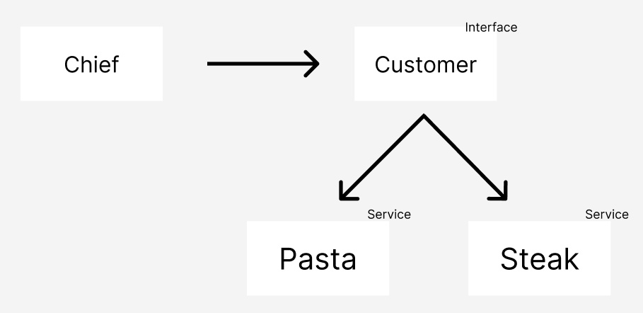

# OCP | 개방 폐쇄의 원칙 (Open Closed Principle)

> 개방 폐쇄의 원칙 : 확장에 대해 열려 있어야 하고, 수정에 대해서는 닫혀 있어야 한다

개방 폐쇄의 원칙의 핵심은 __기존 코드를 건드리지 않는다는 것__ 입니다.

> 어떻게 기존 코드를 수정하지 않고 확장할 수 있는 거지?

저는 여태껏 객체지향 설계를 배우지 않은 채로 개발을 했었죠. 
그렇기 때문에 기존의 코드들로는 이 개방 폐쇄의 원칙을 지키기는 어려움이 있습니다.
그러므로 코드의 __"설계"__ 부터 바꾸어야 합니다.

## 기존의 설계 방식

우선 설계를 바꾸기 전 보통의 사람들이 작성했던 코드 방식을 알아봅시다.

기존에는 유저의 동작을 Service라는 클래스에서 모두 처리했었습니다.
이 Service에 유저가 할 수 있는 동작들을 메소드별로 작성하였죠.

이렇게 되면 기능을 추가하거나 수정할 때면 이 Service 클래스의 코드를 변경할 수 밖에 없는 것이죠

그렇기에 바로 __"인터페이스"__ 를 쓰는 것입니다.
인터페이스를 통해 유저가 할 동작들의 메소드를 나열해놓고
그 동작을 Service 클래스가 Implements를 통해 구현하는 것이죠.

그렇게 되면 처음에 Move1로 구현을 하였다가 이후에 추가하거나 수정할 사항이 생기면
Move2를 만들어서 Action에다 갈아끼우는 것이죠.

마치 코드를 하나의 __"부품"__ 처럼 만들어서 갈아끼우는 것입니다.

## 예시 설명

예를 들어 제가 A사의 키보드를 하나 사서 컴퓨터에 연결해서 사용하고 있었다고 생각해봅시다.

그런데 어느날 이 키보드가 고장이 나서 사용할 수 없게 되고, 
저는 B사의 키보드가 마음에 들어 이 B사의 키보드를 구매하여 사용하는 것입니다.

키보드가 하는 행위는 동일하지만 다른 키보드를 통해서 이 일을 해내고 있죠.

이처럼 설계를 이러한 방법으로 하게 된다면 언제든 우리의 코드는 기존 코드는 변경하지 않고도 기능을 수정하고, 추가할 수 있게 됩니다.