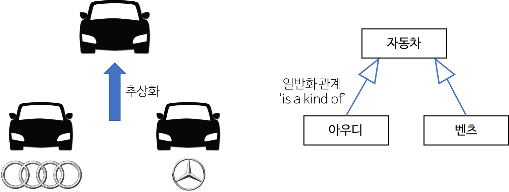
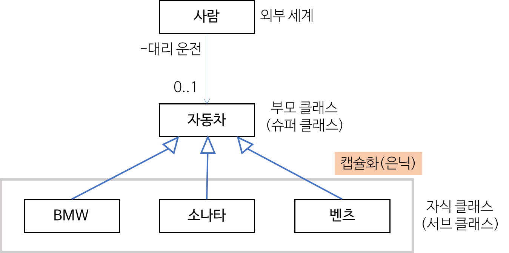

# 객체 지향 프로그래밍 (Object Orinted Programming)

: 실세계에 존재하고 인지하고 있는 객체(Object)를 소프트웨어의 세계에서 표현하기 위해 객체의 핵심적인 개념 또는 기능만을 추출하는  추상화(abstration)를 통해 모델링하려는 프로그래밍 패러다임을 말한다.
다시 말해, 우리가 주변의 실세계에서 사물을 인지하는 방식을 프로그래밍에 접목하려는 사상을 의미한다.

<br>
<br>

# OOP의 기본 구성요소

## 2) 클래스

- Class
      
  - 같은 종류의 집단에 속하는 속성과 행위를 정의한 것
  - 각 클래스는 다른 클래스로부터 독립적으로 디자인한다.
  - 필드, 메서드, 생성자로 이루어져 있다.
- Object
      
  - 클래스의 인스턴스
  - 상위 클래스의 속성을 가진다
  - 개별적인 특성화 행위(Method)를 가지고 있다
- Method
  - 클래스로부터 생성된 객체를 사용하는 방법
  - 객체의 속성을 조작하는데 사용

# OOP의 특징

## 1) 추상화

> ``추상화 : 객체들이 가진 공통의 특성을 파악하고 불필요한 특성들을 제거하는 과정``



- 구체적인 사물들의 공통된 특징, 즉 추상적 특징을 파악해 인식의 대상으로 삼는 행위를 말한다.

## 2) 캡슐화

### 1. 응집도(Cohesion)

- 클래스나 모듈 안의 요소들이 얼마나 밀접하게 관련되어 있는 지를 나타낸다.

### 2. 결합도(Coupling)
- 어떤 기능을 실행하는 데 다른 클래스나 모듈들에 얼마나 의존적인지를 나타낸다.

- 캡슐화는 __낮은 결합도__ 를 유지할 수 있도록 하는 객체지향 설계 원리이다.

- 캡슐화는 __정보 은닉__ 을 통해 높은 응집도와 낮은 결합도를 갖도록 한다.
  - 정보 은닉(information hiding)
    - 필요가 없는 정보는 private를 통해 외부에서 접근하지 못하도록 제한하는 것

  - 정보 은닉이 왜 필요할까?
    - SW는 결합이 많을 수록 문제가 많이 발생하고

      특정 클래스가 수정되면 변경된 클래스의 비밀에 의존하는 다른 클래스들도 변경해야 할 가능성이 커진다는 뜻이기 때문에

> ``캡슐화 : 객체의 데이터를 외부에서 직접 접근하지 못하게 막고, 함수를 통해서만 조작이 가능하게 하는 작업이다.``

- 변수나 메서드를 하나로 묶는 것
- 자신이 가지고 있는 속성에 대해서 해당 상태를 변경하는 기능을 제공해야 한다
- 각각의 메서드는 서로 연관성이 있어야 한다
- 객체의 데이터를 외부에서 직접적 접근 차단
- 함수를 통해서만 조작 가능 (getter, setter, 생성자 등)
- public, private, protected, default

## 3) 일반화 관계

> ``일반화 : 여러 개체들이 가진 공통된 특성을 부각시켜 하나의 개념이나 법칙으로 성립시키는 과정이다``

- 일반화 관계는 객체지향 프로그래밍 관점에서는 __상속 관계__ 라 한다.
- 속성이나 기능의 재사용만 강조하여 사용하는 경우가 많다
> 하지만 이는 일반화 관계를 극히 한정되게 바라보는 시각.

## 일반화는 또다른 캡슐화
> 일반화 관계는 자식 클래스를 외부로부터 은닉하는 캡슐화의 일종이다



- '사람' 클래스 관점에서는 구체적인 자동차의 종류가 숨겨져 있다.
- 즉, 대리 운전자가 자동차의 종류에 따라 운전에 영향을 받지는 않을 것이다.

- 일반화 관계는 한 클래스 안에 있는 속성 및 연산들의 캡슐화에 한정되지 않는다.
  - 즉, 외부 세게에 __자식 클래스 자체를 캡슐화(또는 은닉)하는 것__ 으로 확장된다.
  - 서브 클래스의 캡슐화는 외부 클라이언트가 개별적인 클래스를 무관하게 프로그래밍을 할 수 있게 한다.

## 4) 다형성

> 서로 다른 클래스의 객체가 같은 메시지를 받았을 때 각자의 방식으로 동작하는 능력이다.

- 다형성과 일반화 관계는 코드를 간결하게 할 뿐 아니라 변화에도 유연하게 대처할 수 있게 한다.

```java
// 부모 클래스
public abstract class Pet {
  public abstract void talk();
}
// 자식 클래스
public class Cat extends Pet {
  public void talk(){ System.out.println("야옹"); }
}
public class Dog extends Pet {
  public void talk(){ System.out.println("멍멍"); }
}
public class Parrot extends Pet {
  public void talk(){ System.out.println("안녕"); }
}
```

- 다형성을 사용하는 경우에는 구체적으로 현재 어떤 클래스 객체가 참조되는 지와 무관하게 프로그래밍을 할 수 있다.
- 일반화 관계에 있을 때 부모 클래스의 참조 변수가 자식 클래스의 객체를 참조할 수 있기 때문에 새로운 자식 클래스가 추가되더라도 코드는 영향을 받지 않는다
- 단, 부모 클래스의 참조 변수가 접근할 수 있는 것은 부모 클래스가 물려준 변수와 메서드 뿐이다.

# 요약

## 추상화
- 구체적인 사물들의 공통된 특징, 즉 추상적 특징을 파악해 인식의 대상으로 삼는 행위를 말한다.
## 캡슐화
- SW는 결합이 많을 수록 문제가 많이 발생하기 때문에 정보 은닉을 통해 다른 모듈의 의존률을 낮춰 문제의 발생률을 감소시킨다.
## 일반화 관계
- 자식 클래스 자체를 캡슐화하여 은닉한다.
## 다형성
- 코드의 간결성과 코드의 변화에 있어 유연하게 대처가 가능하게 한다.

# 참고

[gmlwjd9405님의 글](https://gmlwjd9405.github.io/2018/07/05/oop-features.html)