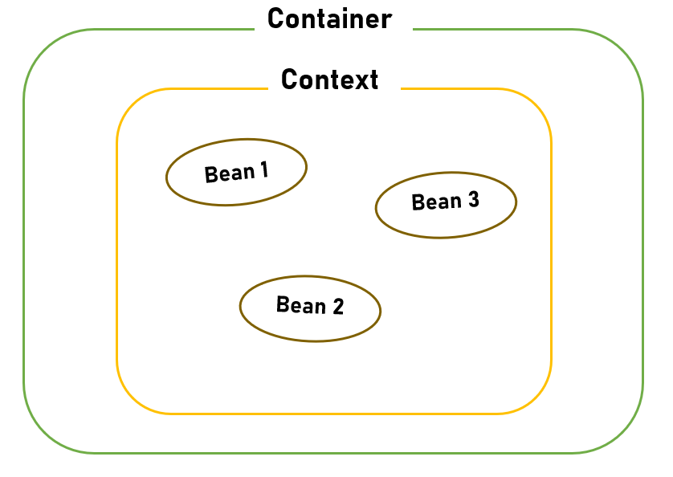

# Context란?

- Bean의 확장 버전으로, **Spring Bean을 좀 더 다루기 쉽도록 기능들이 추가된 공간**

Bean의 등록은 모두 저 Context에서 이뤄지므로,

사실상 Bean들을 직접 설정할 수 있는 공간이라고 할 수 있다.

- Context란, Bean들을 다루기 위해 우리가 설정할 수 있는 공간

## 2. 종류

자바에는 서블릿이란 객체가 존재한다.

모든 객체는 Bean으로 관리되니, 서블릿 또한 Bean으로 존재한다.

이러한 서블릿 Bean들도 각자 공통적인 부분이 있을 것이다.

DB연결을 예로 들면

DB 연결은 어떤 서블릿이건 꼭 갖고 있어야 하는 작업이다.

그런데 **서블릿은 모두 독립적인 객체로 서로 간섭(공유)이 불가능**하다.

그럼 **모든 서블릿 Bean마다 같은 DB 연결**이 들어갈 것인데,

이것은 ``심각히 비효율적``이다.

따라서 스프링의 컨텍스트는 이러한 **공통 부분을 서블릿에서 분리시켜 총 2가지의 Context**가 있다.

### 1. 공통 부분(Root-Context)

: 모든 서블릿이 **공유할 수 있는 Bean들이 모인 공간**을 말한다.

DB와 관련된 Repository나, Service등.

### 2. 개별 부분(Servlet-Context)

: 서블릿 각자의 Bean들이 모인 공간이다.

웹 앱마다 한 개씩 존재하므로, 웹 앱 그 자체를 의미하기도 한다.

이 컨텍스트 내의 Bean들은 서로 공유될 수 없다.

# 🙆‍♂️ 참고 🙇‍♂️
- [https://velog.io/@seculoper235/Spring-Core-Context-1편](https://velog.io/@seculoper235/Spring-Core-Context-1%ED%8E%B8)